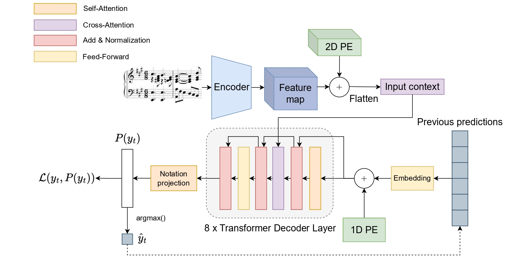

<p align='center'>
  <a href='https://praig.ua.es/'></a>
  <a href='https://www.litislab.fr/'></a>
</p>

<h1 align='center'>Sheet Music Transformer: End-To-End Optical Music Recognition Beyond Monophonic Transcription</h1>
<p align = "center">
	<a href="https://link.springer.com/chapter/10.1007/978-3-031-70552-6_2"></a>
</p>
<p align='center'>
  
  
  
  
</p>

<p align="center">
  <a href="https://huggingface.co/collections/PRAIG/sheet-music-transformer-6853c4ca1bd7980a91677dfd"></a>
  <a href="https://huggingface.co/collections/PRAIG/pianoform-6853c9ef28f3ff9bf33bab97"></a>
</p>

<p align='center'>
  <a href='#about'>About</a> •
  <a href='#contributing'>Contributing</a> •
  <a href='#i-just-want-to-use-the-smt'>How To Use</a> •
  <a href='#citations'>Citations</a> •
  <a href='#acknowledgments'>Acknowledgments</a> •
  <a href='#license'>License</a>
</p>

## About

This GitHub repository contains the implementation of the Sheet Music Transfomrmer (SMT), a novel model for Optical Music Recognition (OMR) beyond monophonic level transcription. Unlike traditional approaches that primarily leverage monophonic transcription techniques for complex score layouts, the SMT model overcomes these limitations by offering a robust image-to-sequence solution for transcribing polyphonic musical scores directly from images.

<p align="center">
  
</p>

## Contributing

If you plan to contribute, please read our [Contributing Guidelines](./CONTRIBUTING.md) first. 
It contains information on how to set up the environment, coding conventions, how to submit pull requests, and how to write clear commit messages.

Feel free to open an [issue](https://github.com/antoniorv6/SMT/issues) if you have a question, idea, or discover a problem.

# Project setup
This project contains the [`uv`](https://docs.astral.sh/uv/) Python dependencies manager. To start a new virtual environment, simply run:

```sh
uv sync
```

### Docker
If you are using Docker to run experiments, create an image with the provided Dockerfile:

```sh
docker build -t <your_tag> .
docker run -itd --rm --gpus all --shm-size=8gb -v <repository_path>:/workspace/ <image_tag>
docker exec -it <docker_container_id> /bin/bash
```
# I just want to use the SMT!
Using the SMT for transcribing scores is very easy, thanks to the HuggingFace Transformers 🤗 library. Just implement the following code and you will have the SMT up and running for transcribing excerpts!
```python
import torch
import cv2
from data_augmentation.data_augmentation import convert_img_to_tensor
from smt_model import SMTModelForCausalLM

image = cv2.imread("sample.jpg")
device = "cuda" if torch.cuda.is_available() else "cpu"
model = SMTModelForCausalLM.from_pretrained("<model_reference>").to(device)

predictions, _ = model.predict(convert_img_to_tensor(image).unsqueeze(0).to(device), 
                               convert_to_str=True)

print("".join(predictions).replace('<b>', '\n').replace('<s>', ' ').replace('<t>', '\t'))

```

Please, replace the `<model_reference>` with the implementation of the SMT it suits your purpose. Currently, this project hosts two models:

- [antoniorv6/smt-grandstaff](https://huggingface.co/antoniorv6/smt-grandstaff)
- [antoniorv6/smt-camera-grandstaff](https://huggingface.co/antoniorv6/smt-camera-grandstaff)
- [antoniorv6/smt-string-quartets](https://huggingface.co/antoniorv6/smt-string-quartets/settings)

# Data

The datasets created to run the experiments are [publicly available](https://huggingface.co/collections/antoniorv6/smt-datasets-66defa88d50145aa1a518822) for replication purposes.

Eveything is implemented through the HuggingFace Datasets 🤗 library, so loading any of these datasets can be done through just one line of code:

```python
import datasets

dataset = datasets.load_dataset('antoniorv6/<dataset-name>')
```

The dataset has two columns: `image` which contains the original image of the music excerpt for input, and the `transcription`, which contains the corresponding `bekern` notation ground-truth that represents the content of this input. 

# Train
These experiments run under the Weights & Biases API and the ```JSON``` config. To replicate an experiment, run one of the following codes depending on the pipeline or stage that you need to replicate.
Please note that the config files are located in the ```config/``` folder, different experiment configs can be found in that directory.

You can make your own config files to train the SMT on your own data! 
> [!TIP] I highly recommend to use your datasets in the same format provided in the HuggingFace Datasets specification to work with this model. If not, I suggest to make your own data.py file from scratch. Please refer to the Data section to know how to structure your dataset. 

## System-level

To reproduce the system-level experiments without synthetic data, run the following commands in your terminal:

```sh
wandb login
uv run train.py --config_path <config-path>
```

## Full-page synthetic pretraining (system-level)

To reproduce the first stage of the full-page training setup (pretraining on synthetic system-level data), run the following commands instead:

```sh
wandb login
uv run fp-train-1.py --config_path <config-path>
```

The full-page configs provided in the repository are organized in two files. The ```pretraining.json``` config is expected to be given to this script.

## Full-page curriculum learning (from system-level to full-page)

To reproduce the second stage of the full-page training setup (curriculum learning with synthetic and real data), run the following commands instead:

```sh
wandb login
uv run fp-train-2.py --config_path <config-path> --starting_checkpoint <checkpoint-path>
```

The full-page configs provided in the repository are organized in two files. The ```finetuning.json``` config is expected to be given to this script.

# Benchmarks
Currently, the available model (SMT NeXt) reports the following metrics:

| **Corpus**             |  | **SMT NeXt**         |          |
|------------------------|-------------|---------|---------|
|                        | **CER**     | **SER** | **LER** |
| GrandStaff (Ideal)     | **3.9**     | **5.1** | **13.1** |
| GrandStaff (Camera)    | **5.3**     | **6.2** | **13.5** |
| Quartets               | **1.3**     | **1.4** | **5.6**  |


## Citations

```bibtex
@InProceedings{RiosVila:ICDAR:2024,
	author="R{\'i}os-Vila, Antonio
		and Calvo-Zaragoza, Jorge
		and Paquet, Thierry",
	title="Sheet Music Transformer: End-To-End Optical Music Recognition Beyond Monophonic Transcription",
	booktitle="Document Analysis and Recognition - ICDAR 2024",
	year="2024",
	publisher="Springer Nature Switzerland",
	address="Cham",
	pages="20--37",
	isbn="978-3-031-70552-6"
}
```

## Acknowledgments

This work is part of the I+D+i PID2020-118447RA-I00 ([MultiScore](https://sites.google.com/view/multiscore-project)) project, funded by MCIN/AEI/10.13039/501100011033. Computational resources were provided by the Valencian Government and FEDER funding through IDIFEDER/2020/003.


## License

This work is under a [MIT](LICENSE) license.
